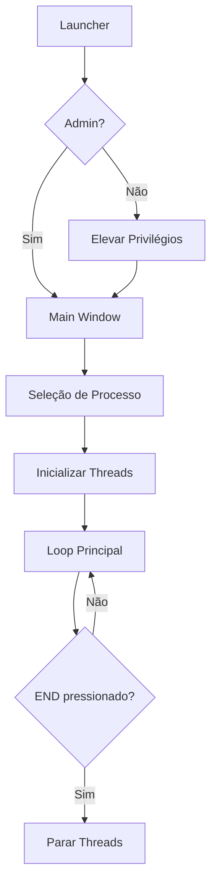

# 🎮 Eliseu Pot - Ragnarok Helper

<div align="center">


**Ferramenta de automação avançada para Ragnarok Online**

*Desenvolvida com interface moderna e arquitetura modular*

</div>

---

## 📋 **Índice**

- [🎯 Características](#-características)
- [📦 Instalação](#-instalação)
- [🚀 Como Usar](#-como-usar)
- [⚙️ Funcionalidades](#️-funcionalidades)
- [🏗️ Arquitetura](#️-arquitetura)
- [🔧 Configuração](#-configuração)
- [📸 Screenshots](#-screenshots)
- [🛠️ Desenvolvimento](#️-desenvolvimento)
- [❓ FAQ](#-faq)
- [📝 Licença](#-licença)

---

## 🎯 **Características**

### ✨ **Principais Recursos**
- 🍯 **AutoPot Inteligente** - HP e SP automático com thresholds configuráveis
- ⚔️ **SkillSpam Avançado** - 3 modos: Spam+Click, Spam, Buff Timer
- 👤 **Sistema de Perfis** - Salve e carregue configurações rapidamente
- 🎨 **Interface Moderna** - Design dark theme responsivo
- 🔒 **Segurança** - Detecção de chat para pausar automação
- 🚀 **Performance** - Threads otimizadas para zero lag

### 🛡️ **Segurança e Estabilidade**
- Detecção automática do processo do jogo
- Pausa inteligente quando chat está ativo
- Verificação de integridade de memória
- Execução segura como administrador
- Tratamento robusto de erros

---

## 📦 **Instalação**

### 📋 **Requisitos**
- Windows 7/8/10/11 (x64)
- Python 3.7 ou superior
- Privilégios de administrador

### 🔧 **Instalação Automática**
```bash
# 1. Clone ou baixe o projeto
git clone https://github.com/seu-usuario/eliseu-pot.git
cd eliseu-pot

# 2. Execute o instalador de dependências
python install_dependencies.py
```

### 📦 **Instalação Manual**
```bash
# Instalar dependências
pip install PyQt5 pymem keyboard pywin32

# Verificar instalação
python debug_startup.py
```

### 📁 **Estrutura de Arquivos**
```
eliseu_pot/
├── 🚀 EliseuPot.bat              # Executar (sem console)
├── 🐛 EliseuPot_Debug.bat        # Executar (com debug)
├── 📄 main.py                    # Arquivo principal
├── 🔧 launcher.py                # Launcher inteligente
├── ⚙️ launcher_config.py         # Configurações
├── config/                       # Configurações
│   ├── constants.py              # Constantes do jogo
│   └── settings.py               # Configurações da app
├── core/                         # Funcionalidades principais
│   ├── admin.py                  # Privilégios administrativos
│   ├── memory.py                 # Leitura de memória
│   └── input.py                  # Envio de teclas/clicks
├── threads/                      # Threads de automação
│   ├── autopot.py                # AutoPot HP/SP
│   ├── skillspam.py              # SkillSpam
│   └── monitor.py                # Monitoramento do jogo
├── ui/                           # Interface do usuário
│   ├── main_window.py            # Janela principal
│   ├── dialogs.py                # Diálogos
│   ├── styles.py                 # Temas e estilos
│   └── tabs/                     # Abas da interface
│       ├── autopot_tab.py        # Aba AutoPot
│       ├── skillspam_tab.py      # Aba SkillSpam
│       └── profiles_tab.py       # Aba Perfis
├── utils/                        # Utilitários
│   ├── profiles.py               # Gerenciamento de perfis
│   └── hotkeys.py                # Hotkeys globais
└── profiles/                     # Perfis salvos
    └── perfis.json
```

---

## 🚀 **Como Usar**

### 🎮 **Início Rápido**

1. **Execute o jogo** Ragnarok Online
2. **Inicie o Eliseu Pot**:
   ```bash
   # Modo silencioso (recomendado)
   EliseuPot.bat
   
   # Modo debug (para troubleshooting)
   EliseuPot_Debug.bat
   ```
3. **Selecione o processo** do jogo na lista
4. **Configure as opções** nas abas
5. **Pressione END** para iniciar/parar automação

### ⌨️ **Controles**
- **END** - Liga/Desliga todas as automações
- **Interface** - Configure através das abas
- **Perfis** - Salve suas configurações favoritas

---

## ⚙️ **Funcionalidades**

### 🍯 **AutoPot (HP/SP)**

<details>
<summary>📊 <strong>Detalhes do AutoPot</strong></summary>

#### **Características:**
- ✅ Monitoramento em tempo real de HP/SP
- ✅ Thresholds configuráveis (1-99%)
- ✅ Teclas personalizáveis
- ✅ Status visual com cores
- ✅ Pausa automática durante chat

#### **Como Configurar:**
1. **Aba AutoPot** → Definir teclas das poções
2. **Ajustar thresholds** com os sliders
3. **Monitorar status** na área de diagnóstico

#### **Exemplo de Uso:**
```
HP: F2 quando HP < 80%
SP: F3 quando SP < 50%
```

</details>

### ⚔️ **SkillSpam**

<details>
<summary>🎯 <strong>Detalhes do SkillSpam</strong></summary>

#### **3 Modos Disponíveis:**

**🔸 Modo 1 - Spam + Click**
- Pressiona tecla + clique do mouse
- Movimento de mouse automático
- Ideal para skills que precisam de target

**🔸 Modo 2 - Spam Tecla**  
- Apenas pressiona a tecla
- Movimento de mouse para anti-detecção
- Para skills de área ou self-cast

**🔸 Modo 3 - Buff Mode**
- Execução automática por timer
- Ideal para buffs de longa duração
- Timer personalizável por tecla

#### **Teclas Suportadas:**
- **F1-F9** - Teclas de função
- **1-9** - Números
- **Q-P, A-L, Z-M** - Letras

#### **Configuração:**
1. **Clique direito** na tecla desejada
2. **Selecione o modo**
3. **Para Modo 3:** Configure o timer
4. **Intervalo Global:** Para Modos 1 e 2

</details>

### 👤 **Sistema de Perfis**

<details>
<summary>💾 <strong>Gerenciamento de Perfis</strong></summary>

#### **Recursos:**
- ✅ Salvar todas as configurações
- ✅ Carregar perfis rapidamente  
- ✅ Múltiplos perfis por personagem
- ✅ Backup automático
- ✅ Carregamento do último perfil

#### **Como Usar:**
1. **Configure** todas as opções desejadas
2. **Aba Perfis** → Digite nome do perfil
3. **Salvar Perfil** → Confirmar
4. **Para carregar:** Selecionar perfil → Carregar

#### **Estrutura do Perfil:**
```json
{
  "MeuPerfil": {
    "autopot_key": "F2",
    "hp_threshold": 80,
    "autopot_sp_key": "F3", 
    "sp_threshold": 50,
    "skillspam_key_configs": {...}
  }
}
```

</details>

---

## 🏗️ **Arquitetura**

### 📐 **Padrão de Design**
```
┌─────────────────┐    ┌─────────────────┐    ┌─────────────────┐
│   Presentation  │    │     Business    │    │      Data       │
│     Layer       │    │      Logic      │    │     Layer       │
├─────────────────┤    ├─────────────────┤    ├─────────────────┤
│ • main_window   │    │ • autopot       │    │ • memory        │
│ • dialogs       │    │ • skillspam     │    │ • profiles      │
│ • tabs          │    │ • monitor       │    │ • settings      │
│ • styles        │    │ • hotkeys       │    │ • constants     │
└─────────────────┘    └─────────────────┘    └─────────────────┘
```

### 🧵 **Sistema de Threads**
- **AutoPot Thread** - Monitoramento contínuo de HP/SP
- **SkillSpam Thread** - Gerenciamento de spam de skills
- **Monitor Thread** - Detecção de chat e status do jogo
- **Main Thread** - Interface do usuário (UI)

### 🔄 **Fluxo de Execução**


---

## 🔧 **Configuração**

### ⚙️ **Configurações Principais**

<details>
<summary>🎛️ <strong>launcher_config.py</strong></summary>

```python
# Configurações de console
SHOW_CONSOLE = False    # Mostra janela do console
DEBUG_MODE = False      # Ativa logs detalhados

# Configurações de admin  
AUTO_ELEVATE = True     # Eleva privilégios automaticamente
REQUIRE_ADMIN = True    # Força execução como admin

# Configurações de interface
HIDE_SPLASH = False     # Esconde tela de splash
MINIMIZE_TO_TRAY = False # Minimiza para system tray
```

</details>

<details>
<summary>🎯 <strong>constants.py</strong></summary>

```python
# Endereços de memória (personalizáveis)
BASE_STATUS_ADDRESS = 0x014A2A54
HP_ADDRESS = BASE_STATUS_ADDRESS + 0x0
SP_ADDRESS = BASE_STATUS_ADDRESS + 0x8

# Timings (ajustáveis)
AUTOPOT_DELAY = 0.04           # Delay após usar poção
SKILLSPAM_DELAY = 0.03         # Intervalo padrão de spam
GAME_MONITOR_INTERVAL = 0.02   # Frequência de monitoramento
```

</details>

### 🎨 **Personalização da Interface**

<details>
<summary>🌈 <strong>Temas e Cores</strong></summary>

O arquivo `ui/styles.py` contém todas as definições de estilo:

```python
# Cores principais
COLORS = {
    "hp_ok": "#98C379",      # Verde para HP normal
    "hp_low": "#E06C75",     # Vermelho para HP baixo  
    "sp_ok": "#61afef",      # Azul para SP normal
    "sp_low": "#E06C75",     # Vermelho para SP baixo
    "paused": "#E5C07B"      # Amarelo para pausado
}
```

**Para personalizar:**
1. Edite as cores em `COLORS`
2. Modifique `get_dark_stylesheet()` para novos estilos
3. Reinicie a aplicação

</details>

---

## 📸 **Screenshots**

### 🖥️ **Interface Principal**
```
┌─────────────────────────────────────────────────────────────┐
│ Eliseu Pot - Ragnarok Helper                          [_][□][X] │
├─────────────────────────────────────────────────────────────┤
│  AutoPot  │  SkillSpam  │  Perfis  │                       │
├─────────────────────────────────────────────────────────────┤
│                                                             │
│  ┌─ Configurações ─────────────────────────────────────┐   │
│  │ Tecla da Poção de HP: [F2] [Definir]                │   │
│  │ Usar se HP < [████████░░] 80%                       │   │
│  │ Tecla da Poção de SP: [F3] [Definir]                │   │  
│  │ Usar se SP < [█████░░░░░] 50%                       │   │
│  └─────────────────────────────────────────────────────┘   │
│                                                             │
│  ┌─ Diagnóstico ───────────────────────────────────────┐   │
│  │ HP: 1250 / 1580 (79%) 🟢                            │   │
│  │ SP: 456 / 890 (51%) 🔵                              │   │
│  └─────────────────────────────────────────────────────┘   │
│                                                             │
└─────────────────────────────────────────────────────────────┘
```

### ⌨️ **SkillSpam Layout**
```
┌─ Teclas de SkillSpam ─────────────────────────────────────┐
│ [F1] [F2] [F3] [F4] [F5] [F6] [F7] [F8] [F9]             │
│ [1]  [2]  [3]  [4]  [5]  [6]  [7]  [8]  [9]              │
│ [Q]  [W]  [E]  [R]  [T]  [Y]  [U]  [I]  [O]  [P]         │
│ [A]  [S]  [D]  [F]  [G]  [H]  [J]  [K]  [L]              │
│ [Z]  [X]  [C]  [V]  [B]  [N]  [M]                        │
└───────────────────────────────────────────────────────────┘
```

---

## 🛠️ **Desenvolvimento**

### 🏗️ **Requisitos de Desenvolvimento**
```bash
# Dependências principais
PyQt5>=5.15.0
pymem>=1.8.0  
keyboard>=0.13.0
pywin32>=227

# Ferramentas de desenvolvimento
black          # Formatação de código
flake8         # Linting
pytest         # Testes
mypy           # Type checking
```

### 🔨 **Setup de Desenvolvimento**
```bash
# Clone o repositório
git clone https://github.com/seu-usuario/eliseu-pot.git
cd eliseu-pot

# Instalar dependências de dev
pip install -r requirements-dev.txt

# Executar testes
python -m pytest tests/

# Formatação de código
black . --line-length 88

# Verificação de tipos
mypy --strict .
```

### 🧪 **Executar Testes**
```bash
# Todos os testes
python -m pytest

# Testes específicos
python -m pytest tests/test_autopot.py
python -m pytest tests/test_memory.py -v

# Com coverage
python -m pytest --cov=. --cov-report=html
```

### 📊 **Estrutura de Testes**
```
tests/
├── __init__.py
├── test_autopot.py      # Testes do AutoPot
├── test_skillspam.py    # Testes do SkillSpam  
├── test_memory.py       # Testes de memória
├── test_profiles.py     # Testes de perfis
└── fixtures/            # Dados de teste
    ├── sample_profiles.json
    └── mock_memory.py
```

### 🚀 **Build e Distribuição**
```bash
# Criar executável
pip install pyinstaller
pyinstaller --onefile --windowed main.py

# Criar instalador
pip install nsis
makensis installer.nsi
```

---

## ❓ **FAQ**

### 🔧 **Problemas Comuns**

<details>
<summary><strong>❌ "Processo do jogo não encontrado"</strong></summary>

**Possíveis causas:**
- Jogo não está rodando
- Jogo rodando como admin e Eliseu Pot não
- Processo com nome diferente

**Soluções:**
1. Certifique-se que o jogo está rodando
2. Execute Eliseu Pot como administrador
3. Verifique se o processo aparece na lista
4. Tente reiniciar ambos os programas
</details>

<details>
<summary><strong>⚠️ "Hotkeys não funcionam"</strong></summary>

**Possíveis causas:**
- Não está executando como administrador
- Outro programa interceptando hotkeys
- Conflito com hotkeys do jogo

**Soluções:**
1. Execute como administrador (obrigatório)
2. Feche outros programas de hotkey
3. Use hotkeys diferentes
4. Verifique se a tecla END funciona
</details>

<details>
<summary><strong>🐌 "AutoPot muito lento/rápido"</strong></summary>

**Ajustes disponíveis:**
- `AUTOPOT_DELAY` em `constants.py`
- `AUTOPOT_CHECK_INTERVAL` para frequência
- Threshold dos sliders

**Valores recomendados:**
```python
AUTOPOT_DELAY = 0.04        # 40ms entre poções
AUTOPOT_CHECK_INTERVAL = 0.02  # Check a cada 20ms
```
</details>

<details>
<summary><strong>🎯 "SkillSpam não funciona em algumas skills"</strong></summary>

**Possíveis causas:**
- Skill com cooldown muito alto
- Intervalo de spam muito baixo
- Posição do cursor

**Soluções:**
1. Aumentar intervalo global de spam
2. Usar Modo 3 (Buff) para skills com cooldown
3. Posicionar cursor corretamente
4. Verificar se a tecla está correta
</details>

### 💡 **Dicas de Uso**

<details>
<summary><strong>🎮 Otimização de Performance</strong></summary>

**Para melhor performance:**
1. **Feche programas desnecessários**
2. **Use intervalos adequados:**
   - AutoPot: 20-50ms
   - SkillSpam: 30-100ms
   - Monitor: 20ms
3. **Configure thresholds realistas:**
   - HP: 70-90%
   - SP: 30-70%
4. **Use perfis específicos por classe**

</details>

<details>
<summary><strong>🛡️ Uso Seguro</strong></summary>

**Boas práticas:**
1. **Não use AFK** - mantenha supervisão
2. **Configure pausas** durante chat
3. **Use intervalos humanizados**
4. **Varie os padrões** de uso
5. **Respeite as regras** do servidor

</details>

---

## 🤝 **Contribuindo**

### 📝 **Como Contribuir**
1. **Fork** o projeto
2. **Crie uma branch** para sua feature (`git checkout -b feature/MinhaFeature`)
3. **Commit** suas mudanças (`git commit -m 'Adiciona MinhaFeature'`)
4. **Push** para a branch (`git push origin feature/MinhaFeature`)
5. **Abra um Pull Request**

### 🐛 **Reportar Bugs**
Abra uma **issue** com:
- **Descrição** detalhada do problema
- **Passos** para reproduzir
- **Screenshots** se aplicável
- **Logs** de erro
- **Configuração** do sistema

### 💡 **Sugerir Features**
- Use a tag `enhancement`
- Descreva o **caso de uso**
- Explique o **comportamento esperado**
- Adicione **mockups** se possível

---

## 📝 **Licença**

Este projeto está licenciado sob a **MIT License** - veja o arquivo [LICENSE](LICENSE) para detalhes.

```
MIT License

Copyright (c) 2024 Eliseu Pot

Permission is hereby granted, free of charge, to any person obtaining a copy
of this software and associated documentation files (the "Software"), to deal
in the Software without restriction, including without limitation the rights
to use, copy, modify, merge, publish, distribute, sublicense, and/or sell
copies of the Software, and to permit persons to whom the Software is
furnished to do so, subject to the following conditions:

The above copyright notice and this permission notice shall be included in all
copies or substantial portions of the Software.

THE SOFTWARE IS PROVIDED "AS IS", WITHOUT WARRANTY OF ANY KIND, EXPRESS OR
IMPLIED, INCLUDING BUT NOT LIMITED TO THE WARRANTIES OF MERCHANTABILITY,
FITNESS FOR A PARTICULAR PURPOSE AND NONINFRINGEMENT. IN NO EVENT SHALL THE
AUTHORS OR COPYRIGHT HOLDERS BE LIABLE FOR ANY CLAIM, DAMAGES OR OTHER
LIABILITY, WHETHER IN AN ACTION OF CONTRACT, TORT OR OTHERWISE, ARISING FROM,
OUT OF OR IN CONNECTION WITH THE SOFTWARE OR THE USE OR OTHER DEALINGS IN THE
SOFTWARE.
```

---

## 🙏 **Agradecimentos**

- **PyQt5** - Framework de interface gráfica
- **pymem** - Biblioteca de manipulação de memória
- **keyboard** - Captura de teclas globais
- **pywin32** - APIs do Windows
- **Comunidade RO** - Feedback e sugestões

---

## 📞 **Contato**

- **Discord**: eliseu777

---

<div align="center">

**⭐ Se este projeto te ajudou, considere dar uma estrela!**

**🚀 Happy Ragging! 🗡️**

</div>
